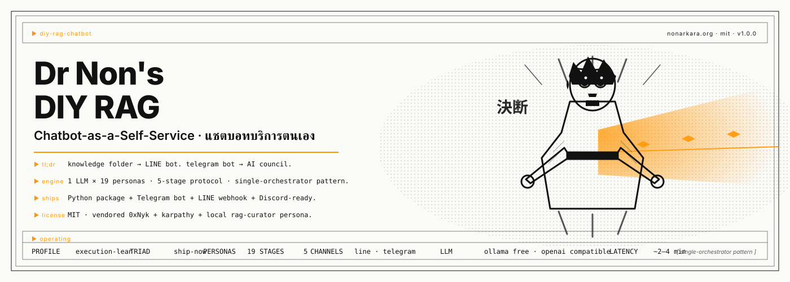

# Dr Non's DIY RAG / Chatbot-as-a-Self-Service

**แร็กทำเองของดร.นน · แชตบอทบริการตนเอง · สภาที่ปรึกษาในกล่องเดียว**

<p align="center">
  
</p>

<p align="center">
  <em><strong>โฟลเดอร์คือสมอง · ไลน์คือปาก · โมเดลคือล่าม · สภา 19 คนคือที่ปรึกษา</strong></em>
</p>

<p align="center">
  Turn any knowledge folder into a LINE / Telegram bot that answers <em>only</em> from the folder — plus a deployable in-process AI council for hard decisions. One Python process. 19 personas. MIT.
</p>

<p align="center">
  <a href="https://github.com/Nonarkara/diy-rag-chatbot/blob/main/START-HERE.md"></a>
  &nbsp;
  <a href="https://github.com/Nonarkara/diy-rag-chatbot/blob/main/AGENTS.md"></a>
  &nbsp;
  <a href="https://nonarkara.github.io/diy-rag-chatbot/"></a>
</p>

<p align="center">
  <a href="https://github.com/Nonarkara/diy-rag-chatbot/blob/main/START-HERE.md">Start</a> ·
  <a href="https://github.com/Nonarkara/diy-rag-chatbot/blob/main/AGENTS.md">AGENTS.md</a> ·
  <a href="https://github.com/Nonarkara/diy-rag-chatbot/blob/main/council/SKILL.md">Council skill</a> ·
  <a href="https://github.com/Nonarkara/diy-rag-chatbot/blob/main/bot/README.md">Telegram bot</a> ·
  <a href="https://github.com/Nonarkara/diy-rag-chatbot/blob/main/docs/architecture/council-architecture.md">Architecture</a> ·
  <a href="https://github.com/Nonarkara/diy-rag-chatbot/blob/main/docs/architecture/ILLUSTRATIONS.md">Illustrations</a> ·
  <a href="https://github.com/Nonarkara/diy-rag-chatbot/blob/main/START-HERE.md#station-17--optional-council-bot-on-telegram">Deploy</a> ·
  <a href="https://github.com/Nonarkara/diy-rag-chatbot/blob/main/AGENTS.md#deployable-council-bot-bot">FAQ</a>
</p>

<p align="center">
  
  &nbsp;
  
</p>

<p align="center">
  
  
  
  
  
  <br>
  
  
  
  
</p>

---

**TL;DR (Thai):** โยนไฟล์ลงโฟลเดอร์ `knowledge/` → บอท LINE ตอบจากไฟล์นั้นเท่านั้น (ถ้าไม่มีก็บอกว่าไม่มี ไม่เดา) → เมื่อต้องตัดสินใจเรื่องใหญ่ ๆ เรียกสภา 19 คนผ่าน `bin/council "คำถาม"` หรือส่งข้อความไปที่ Telegram bot (`python -m bot`) — ทั้งหมดนี้คือ **single-orchestrator pattern** ที่แก้ปัญหา "หลายบอทคุยกันไม่ได้" ของ Telegram

**TL;DR (English):** Drop files into `knowledge/` → the LINE bot answers only from those files (refuses when not there, never guesses) → for hard decisions, convene the 19-persona council via `bin/council "question"` or message the Telegram bot (`python -m bot`). This is the **single-orchestrator pattern** — the answer to the multi-bot Telegram failure where bots can't address each other.

**สไลด์ภาษาไทย 31 สไลด์** พร้อม [English README](#english) ด้านล่าง

---

## Why this repo is on par with top AI-council repos


**Three projects** the rest of the world calls "AI council":

- **[0xNyk/council-of-high-intelligence](https://github.com/0xnyk/council-of-high-intelligence)** — 4.2k stars. 18 personas, 5-stage protocol, runs in a host CLI.
- **[karpathy/llm-council](https://github.com/karpathy/llm-council)** — 24.8k stars. Multi-model parallel + review + chairman, web app + OpenRouter.
- **This repo, `Nonarkara/diy-rag-chatbot`** — the orchestrator pattern as a deployable Telegram bot. The single-process, multi-persona architecture.

What we add that the other two do not:

1. **A RAG-specific 19th persona** (`council-rag-curator`) that opens the cited file before commenting on what it says. The 0xNyk personas are general-purpose; this one is for *this* domain.
2. **A `bin/llm-council` shim** that auto-detects whether the karpathy app is up and falls back to 0xNyk otherwise. Neither of the upstream projects have a fallback path.
3. **A Telegram deployable bot** (`bot/`) that runs the same 0xNyk protocol in-process. 0xNyk requires a host CLI; karpathy requires a separate web app. This repo gives you `python -m bot` and you're done.
4. **The single-orchestrator pattern as a documented anti-pattern fix** for the multi-bot Telegram failure mode. Anyone who has tried the multi-bot approach has hit the same wall. The fix lives here.

What we share:

- The same 5-stage 0xNyk protocol (vendored, MIT).
- The same 3-stage karpathy pattern (vendored as text, MIT-style upstream).
- The same 18 personas (vendored, MIT).
- The same verdict discipline: kill criteria, dissent preserved, concrete next step.

This repo is not a fork of either. It is a third project that
**adopts both patterns** and ships them in a deployable form for end users,
with the lessons of trying (and failing) the multi-bot approach
documented as a guard against the same failure repeating.

รายละเอียดทั้งหมด: [docs/architecture/council-architecture.md](docs/architecture/council-architecture.md) · [docs/architecture/ILLUSTRATIONS.md](docs/architecture/ILLUSTRATIONS.md)

---

เปิดสไลด์ในเบราว์เซอร์:

- ไฟล์ท้องถิ่น: `open deck/index.html`
- ออนไลน์: [nonarkara.github.io/diy-rag-chatbot](https://nonarkara.github.io/diy-rag-chatbot/)
- ต้นทาง: [github.com/Nonarkara/diy-rag-chatbot](https://github.com/Nonarkara/diy-rag-chatbot)

หรือเสิร์ฟที่ `http://127.0.0.1:8765/deck/`

```bash
python3 -m http.server 8765
```

ลูกศรซ้ายขวาเลื่อนสไลด์ · ⌘P พิมพ์เป็น PDF แนวนอน

---

## English

Clone this repo, then tell your AI agent:

> Read AGENTS.md and START-HERE.md and walk me through each station until the LINE Official Account answers from the knowledge folder. Do not skip steps. Do not ask me to paste secrets into chat.

A 31-slide Thai briefing (`deck/`) and an 18-slide Axiom PowerPoint/PDF sit in the repo. The bot **answers only from those files** and **refuses when it cannot**. After LINE works, the same folder can speak through Telegram and Discord. Compute is a choice: this computer 24/7, Railway, or paid Render — **not Vercel for the bot**.

Designed in [Axiom Design Core](https://github.com/Nonarkara/Axiom-Design-Core) Editorial mode. This is **not** an official product of depa, the Smart City Thailand Office, or LY Corporation.

---

## สิ่งที่เด็คสอน

1. โยนไฟล์ลงโฟลเดอร์ความรู้
2. สร้าง LINE Official Account ที่ [manager.line.biz](https://manager.line.biz) แล้วเปิด Messaging API จากหน้าบัญชี — **สร้างชาแนลตรงจาก Developers Console ไม่ได้อีกแล้ว** (ตั้งแต่ 4 ก.ย. 2024)
3. วาง `LINE_CHANNEL_SECRET` และ `LINE_CHANNEL_ACCESS_TOKEN` ใน `.env`
4. เลือกสมอง: Ollama (`gemma4:e2b` / `gemma4:e4b` / DeepSeek) บนแรม 8–16 GB หรือคีย์ฟรี Groq / Gemini
5. ให้ LINE ถึงเครื่องผ่าน Cloudflare Tunnel (`cloudflared tunnel --url http://127.0.0.1:8000`)
6. ตรวจลายเซ็นเว็บฮุคทุกครั้ง
7. รั้ว: ไม่มีหลักฐานในไฟล์ = ปฏิเสธ ไม่เดา
8. เลือกที่รัน: เครื่องเปิดค้าง / Railway / Render จ่าย — อย่าใช้ Vercel เป็นที่รันบอท
9. (ไม่บังคับ) Telegram @BotFather และ Discord slash `/ask`

บทเรียนมาจากระบบที่วิ่งอยู่ที่ [rag.nonarkara.org](https://rag.nonarkara.org) ไม่ใช่จากบล็อกทฤษฎี คลัง Smart City Thailand คือมาตรฐานการจัดไฟล์ที่ชุดนี้ให้คัดลอก (`knowledge/HOW-WE-FILE.md`)

---

## โครงสร้าง

```
START-HERE.md            จับมือทีละเว็บ รวมที่รัน Telegram Discord
AGENTS.md                สัญญาของเอเจนต์ — พาทีละสถานี
LINE_RAG_Claude_Code_Master_Prompt.md   ให้เอเจนต์สร้างเครื่อง
knowledge/HOW-WE-FILE.md สัญญาจัดเก็บแบบ Smart City Thailand
docs/shots/              ภาพหน้าสมัครที่ต้องกดเอง
LINE_RAG_OA_Guide_TH_Axiom.pptx / .pdf  สำเนานำเสนอ
deck/                    สไลด์ภาษาไทย
PROMPT.md                ชี้ไปที่ master prompt
council/                 โหมดสภา (vendored) — ดูหัวข้อถัดไป
.council.yaml           ค่าตั้งต้นของสภาสำหรับ repo นี้
bin/council              ครอบคำสั่ง /council ให้รันได้ทันที
karpathy-council/        3-stage multi-model pattern (adapted) — ดู docs/architecture
bin/llm-council          ครอบ karpathy app (localhost:8001) → fall back ไป bin/council
bot/                     Telegram council bot (in-process) — deployable council-as-a-service
docs/architecture/       ผัง SVG + council-architecture.md (อธิบายสอง engine)
```

ทางลัด: โคลน repo นี้ แล้วบอกเอเจนต์ว่า

> อ่าน AGENTS.md กับ START-HERE.md แล้วพาฉันทำทีละขั้น
> จนกว่า LINE Official Account จะตอบจากโฟลเดอร์ knowledge ได้
> อย่าข้ามขั้น อย่าให้ฉันวางคีย์ลงในแชต


---

## Council mode (โหมดสภา)

เมื่อต้องตัดสินใจเรื่องใหญ่ ๆ เกี่ยวกับบอท เช่น เปลี่ยน prompt, เพิ่ม Telegram, ตัดไฟล์เก่าทิ้ง, เลือก embedding ตัวใหม่ — ใช้สภาช่วยคิด repo นี้มี **สอง engine** ให้เลือก

```bash
# Engine A — 0xNyk Council (vendored, default)
#   one LLM × 18 personas · 5-stage protocol · RAG-aware (rag-curator)
./bin/council "Should we add streaming responses to the LINE bot?"
./bin/council --quick --triad ship-now "Ship today with the flaky test?"
./bin/council --duo --members torvalds,rams "Is the prompt under 1,500 chars?"
./bin/council --triad architecture "Monorepo or polyrepo for adapters?"

# Engine B — karpathy LLM Council (adapted, when its app is on localhost:8001)
#   many LLMs × 3-stage protocol · cross-model-family review
./bin/llm-council "What do Claude, GPT, and Gemini each think of this prompt?"
./bin/llm-council --karpathy=off "Should we drop the Smart City standards section?"
```

สอง engine นี้ต่างกัน — ดู [docs/architecture/council-architecture.md](docs/architecture/council-architecture.md) สำหรับผังเปรียบเทียบและ decision rule ว่าเมื่อไหร่ใช้ตัวไหน

ตัวเลือกที่ใช้บ่อย (0xNyk):

| Flag | ความหมาย |
|---|---|
| `--quick` | โหมดเร็ว 2 รอบ ไม่มี cross-examination |
| `--duo` | สภา 2 คน เน้นดึงกัน (Torvalds vs Musashi, Rams vs Ada, …) |
| `--triad <name>` | สภา 3 คนตามโดเมน (architecture, ship-now, ai-product, …) |
| `--full` | สภาครบ 18 คน (overrides `.council.yaml`) |
| `--members a,b,c` | เลือกคนเอง (2–11 คน) |

ค่าตั้งต้นของ repo นี้อยู่ใน [`.council.yaml`](.council.yaml) — `profile: execution-lean`, `triad: ship-now`, `no_auto_route: true` เพราะเป็นโปรเจกต์ที่ต้อง ship

โฮสต์ที่รองรับ: **Claude Code** (ติดตั้งอยู่) และ **OpenCode** (ติดตั้งอยู่) — `bin/council` ตรวจให้อัตโนมัติว่าใช้ตัวไหน และติดตั้ง skill ให้เมื่อยังไม่มี (ดูตัวเลือก `--no-install` เมื่อไม่อยากให้ติดตั้ง)

เอเจนต์พิเศษที่เพิ่มเข้ามาสำหรับโปรเจกต์ RAG นี้: `council-rag-curator` — ผู้คุมคลังความรู้ ที่จะถามว่า "คำตอบนี้ยืนอยู่บนไฟล์จริงหรือเปล่า" ทุกครั้ง (ดู [council/agents/council-rag-curator.md](council/agents/council-rag-curator.md))

รายละเอียดทั้งหมดของโปรโตคอล: [council/SKILL.md](council/SKILL.md)  ·  ที่มาและใบอนุญาต: [council/VENDORED-FROM.md](council/VENDORED-FROM.md)  ·  แผนผัง: [docs/architecture/council-architecture.md](docs/architecture/council-architecture.md)

---

## แหล่งอ้างอิงที่ใช้ทำเด็ค

- [Get started with the Messaging API](https://developers.line.biz/en/docs/messaging-api/getting-started/)
- [Build a bot](https://developers.line.biz/en/docs/messaging-api/building-bot/)
- [Receive messages (webhook)](https://developers.line.biz/en/docs/messaging-api/receiving-messages/)
- [Cloudflare Quick Tunnels](https://developers.cloudflare.com/cloudflare-one/networks/connectors/cloudflare-tunnel/do-more-with-tunnels/trycloudflare/)
- [Ollama · gemma4](https://ollama.com/library/gemma4)
- [Groq keys](https://console.groq.com/keys) · [Google AI Studio keys](https://aistudio.google.com/app/apikey)

---

© 2026 Non Arkaraprasertkul / Axiom X Co., Ltd. · MIT on original text and code in this repository.
LINE and Smart City Thailand marks remain their owners'.
