# เริ่มที่นี่ — จับมือทำทีละเว็บ

ชุดนี้ชื่อ **Dr Non's DIY RAG / Chatbot-as-a-Self-Service**

ทางลัดที่ถูก:

1. โคลน repo นี้
2. เปิด Cursor / Claude Code / เอเจนต์ใดก็ได้ในโฟลเดอร์นี้
3. พิมพ์ประโยคนี้:

> อ่าน AGENTS.md กับ START-HERE.md แล้วพาฉันทำทีละขั้น จนกว่า LINE Official Account จะตอบจากโฟลเดอร์ knowledge ได้ อย่าข้ามขั้น อย่าให้ฉันวางคีย์ลงในแชต

เอเจนต์จะเปิดเว็บให้ทีละหน้า บอกปุ่มที่ต้องกด แล้วรอให้คุณพิมพ์ **เสร็จแล้ว**

ถ้าไม่มีเอเจนต์ อ่านไฟล์นี้จากบนลงล่างเองก็ได้ — ลิงก์ทุกอันเปิดได้จริง

ไม่ใช่ผลิตภัณฑ์ทางการของ depa, สำนักงานเมืองอัจฉริยะ, หรือ LINE

---

## สิ่งที่จะได้เมื่อจบ

คนทัก LINE Official Account ของคุณ → ระบบค้นไฟล์ในโฟลเดอร์ `knowledge/` → ตอบจากไฟล์นั้นเท่านั้น → ถ้าไม่มีในไฟล์ จะพูดว่าไม่มี ไม่เดา

คอมพิวเตอร์เครื่องนี้ต้องเปิดอยู่ ปิดเครื่อง = บอทตาย

---

## สถานี 0 · โคลนชุดนี้

> **ถ้าต้องตัดสินใจเรื่องใหญ่ ๆ ระหว่างทาง** (เช่น เลือก embedding, เปลี่ยน prompt, เพิ่ม Telegram, ตัดไฟล์ทิ้ง) — เอเจนต์จะเสนอใช้ `bin/council "คำถาม"` เพื่อเรียกสภา 18 คนมาช่วยคิด (ดู README → Council mode) ไม่ต้องสั่งเอง เอเจนต์จัดการให้

บนแม็ค เปิด Terminal แล้ววาง:

```bash
git clone https://github.com/Nonarkara/diy-rag-chatbot.git
cd diy-rag-chatbot
```

ถ้ายังไม่มี git: เปิด [github.com/Nonarkara/diy-rag-chatbot](https://github.com/Nonarkara/diy-rag-chatbot) → ปุ่มเขียว **Code** → **Download ZIP** → แตกไฟล์ → เปิดโฟลเดอร์นั้นใน Cursor

ดูภาพรวมได้ที่ `deck/index.html` (ลูกศรซ้ายขวา) หรือ https://nonarkara.github.io/diy-rag-chatbot/

พิมพ์ **เสร็จแล้ว** เมื่อโฟลเดอร์นี้เปิดอยู่ในเอเจนต์แล้ว

---

## สถานี 1 · ติดตั้ง Python

เปิด: https://www.python.org/downloads/

1. กดปุ่มเหลือง **Download Python**
2. ติดตั้ง
3. **บนวินโดวส์: ติ๊ก “Add python.exe to PATH”** ก่อนกด Install
4. ปิดหน้าต่างติดตั้ง

ตรวจว่าใช้ได้ — เปิด Terminal / PowerShell พิมพ์:

```bash
python3 --version
```

ต้องเห็น `Python 3.11` หรือใหม่กว่า (บนวินโดวส์ถ้า `python3` ไม่มี ลอง `python --version`)

พิมพ์ **เสร็จแล้ว** เมื่อเห็นเลขรุ่น

---

## สถานี 2 · เลือกสมอง

เลือกอย่างใดอย่างหนึ่งก่อน ใส่อีกอันทีหลังได้

### ทาง A — ในเครื่อง (ข้อความไม่ออกจากบ้าน)

เปิด: https://ollama.com/download

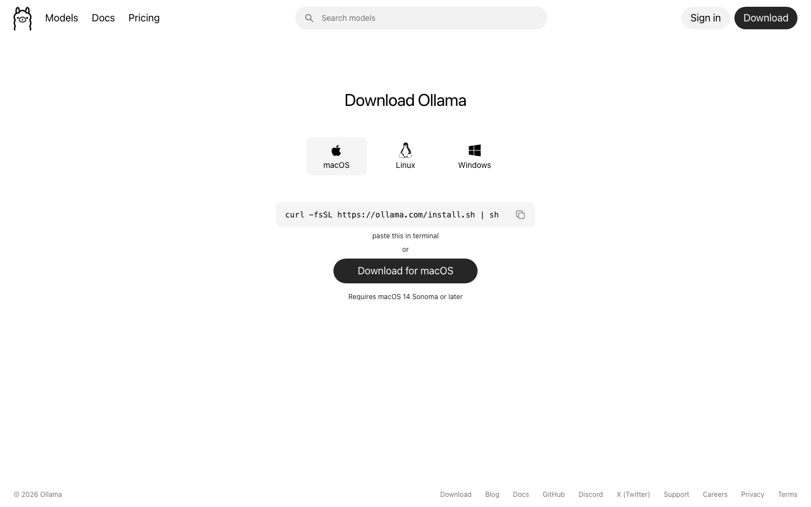

1. ดาวน์โหลด Ollama สำหรับแม็คหรือวินโดวส์
2. ติดตั้ง แล้วเปิดแอป Ollama ค้างไว้
3. ใน Terminal:

```bash
ollama pull bge-m3
ollama pull gemma4:e4b
```

แรม 8 GB ให้ใช้ `gemma4:e2b` แทน e4b  
`bge-m3` บังคับถ้าเอกสารมีภาษาไทย — อย่าใช้ nomic-embed-text

### ทาง B — คีย์ฟรีบนเน็ต (เร็ว โควตามีเพดาน)

เปิด: https://console.groq.com/keys

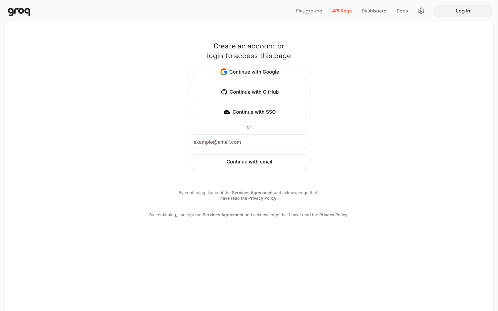

1. Sign up ด้วย Google / GitHub / อีเมล — **ไม่ต้องบัตร**
2. เมนูซ้าย **API Keys** → **Create API Key**
3. ตั้งชื่อ เช่น `diy-rag`
4. คัดลอกคีย์ **ทันที** (โชว์ครั้งเดียว) ไปไว้ในโน้ตบนเครื่องคุณ อย่าวางในแชต

ทางอื่น: https://aistudio.google.com/app/apikey (Gemini)

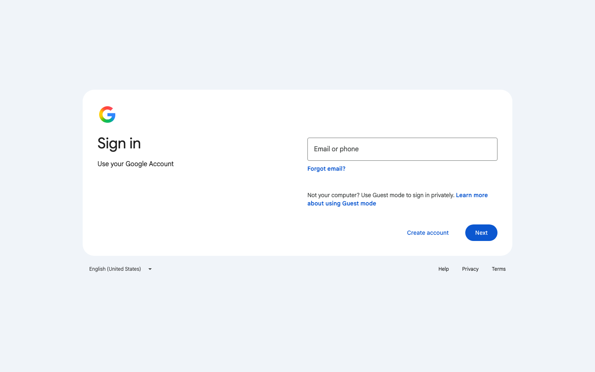

ถ้าจะให้เอเจนต์สร้างเครื่องตาม `LINE_RAG_Claude_Code_Master_Prompt.md` เปิดหน้า Claude Code ที่ต้องสมัครเอง:

เปิด: https://claude.com/product/claude-code

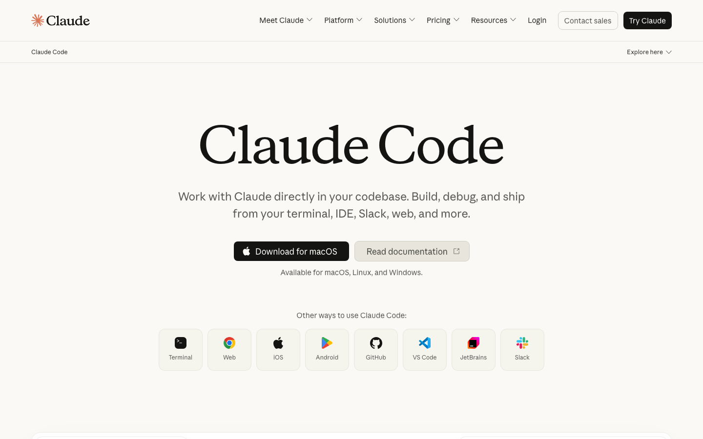

พิมพ์ **เสร็จแล้ว** เมื่อ Ollama โหลดโมเดลครบ หรือมีคีย์อยู่ในโน้ตบนเครื่อง

---

## สถานี 3 · สมัคร LINE Business ID

เปิด: https://account.line.biz/  
ถ้าเข้าตรงไม่ได้ ให้เปิด https://manager.line.biz/ จะเด้งไปหน้าล็อกอิน Business ID

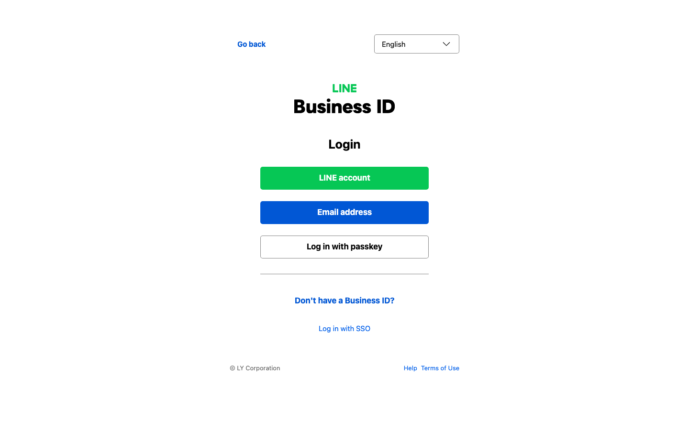

หน้านี้คือปากของระบบ คุณสมัครเอง เอเจนต์กดแทนไม่ได้

1. เลือกภาษาได้ที่มุมบน (ภาษาไทยอยู่ในรายการ)
2. กด **LINE account** (เขียว) ถ้าจะใช้บัญชีไลน์ส่วนตัว หรือ **Email address** (น้ำเงิน) ถ้ามีอีเมลธุรกิจ
3. ลิงก์ **Don't have a Business ID?** คือทางสมัครใหม่
4. จบเมื่อเข้าหน้าบัญชีได้โดยไม่มีหน้า error

แหล่งที่มา: [LINE — Get started with the Messaging API](https://developers.line.biz/en/docs/messaging-api/getting-started/)

พิมพ์ **เสร็จแล้ว** เมื่อล็อกอิน account.line.biz ได้

---

## สถานี 4 · สร้าง LINE Official Account

เปิด: https://manager.line.biz/

1. ถ้ายังไม่มี OA ให้กดสร้าง Official Account
2. กรอกชื่อบัญชีที่จะให้ลูกค้าเห็น เช่น 「บอทความรู้หน่วยงาน」
3. บันทึก
4. เข้าหน้าจัดการบัญชีนั้นได้

คุณยัง **ไม่** ไปที่ Developers Console ในขั้นนี้

พิมพ์ **เสร็จแล้ว** เมื่อเห็นชื่อบัญชีใน OA Manager

---

## สถานี 5 · เปิด Messaging API จากหน้าบัญชี

ยังอยู่ที่ https://manager.line.biz/ — เลือกบัญชีที่เพิ่งสร้าง

1. เมนู **ตั้งค่า** (Settings)
2. **Messaging API**
3. กด **Enable Messaging API** / เปิดใช้งาน Messaging API
4. ถ้าขึ้นให้สร้างบัญชีนักพัฒนา กรอกชื่อกับอีเมล
5. **เลือก Provider** — อ่านก่อนกด ย้ายชาแนลข้าม Provider ทีหลังไม่ได้
6. ตกลงจนจบ

ตั้งแต่วันที่ **4 กันยายน 2024** สร้าง Messaging API channel ตรงจาก Developers Console ไม่ได้อีกแล้ว ปุ่มนั้นไม่มีเพราะถูกปิด ไม่ใช่เพราะคุณหาไม่เจอ

พิมพ์ **เสร็จแล้ว** เมื่อหน้า Messaging API ใน OA Manager ไม่ขึ้นปุ่ม Enable แล้ว

---

## สถานี 6 · หยิบสองคีย์ จาก Developers Console

เปิด: https://developers.line.biz/console/

ล็อกอินด้วย **บัญชีเดียวกับ** ที่ใช้ใน OA Manager

หน้าแรกของนักพัฒนาถ้ายังไม่ล็อกอิน:


1. คลิก **Provider** ที่เลือกตอนสถานี 5
2. คลิกชาแนลประเภท **Messaging API** (ชื่อเดียวกับ OA)
3. แท็บ **Basic settings**
   - คัดลอก **Channel secret** → เปิดไฟล์ `.env` ในโฟลเดอร์นี้ (ถ้ายังไม่มี ให้คัดลอกจาก `.env.example`) วางที่บรรทัด `LINE_CHANNEL_SECRET=`
4. แท็บ **Messaging API**
   - ช่อง **Channel access token** กด **Issue**
   - ใช้แบบกำหนดวันหมดอายุได้ (v2.1) ดีกว่าแบบไม่มีวันหมด
   - วางที่บรรทัด `LINE_CHANNEL_ACCESS_TOKEN=` ใน `.env`
5. อย่าแคปหน้าจอที่มีโทเคน อย่าคอมมิต `.env` อย่าวางค่าลงแชตนี้

สองคีย์คนละหน้าที่:

| ฟิลด์ใน `.env` | ทำอะไร |
|---|---|
| `LINE_CHANNEL_SECRET` | พิสูจน์ว่าเว็บฮุคมาจาก LINE จริง |
| `LINE_CHANNEL_ACCESS_TOKEN` | ให้เครื่องคุณส่งข้อความกลับ |

พิมพ์ **เสร็จแล้ว** เมื่อ `.env` มีสองบรรทัดนี้ไม่ว่าง (ไม่ต้องโชว์ค่า)

---

## สถานี 7 · ปิดทักทายและตอบอัตโนมัติ

กลับไป https://manager.line.biz/ → บัญชีคุณ

1. **การตอบกลับ** / Response
2. **ข้อความทักทาย** = ปิด
3. **ข้อความตอบกลับอัตโนมัติ** = ปิด

ค่าเริ่มต้นตอนเปิด Messaging API คือเปิดทั้งคู่ คนใช้จะได้คำตอบซ้ำสองรอบ

ยังไม่ต้องใส่ Webhook URL ในขั้นนี้ จะใส่หลังอุโมงค์ติด

พิมพ์ **เสร็จแล้ว** เมื่อสวิตช์สองตัวเป็นปิด

---

## สถานี 8 · โยนไฟล์ลงสมอง — จัดให้ดึงได้

ในโฟลเดอร์โปรเจกต์มี `knowledge/` อ่านสัญญาจัดเก็บก่อน: [knowledge/HOW-WE-FILE.md](knowledge/HOW-WE-FILE.md)

แบบอย่างที่ชุดนี้คัดลอกมาคือคลัง **Smart City Thailand** บน rag.nonarkara.org: ต้นฉบับอยู่ `RAW/` · หน้าที่กลั่นแล้วอยู่ `WIKI/{หมวด}/*.md` · `INDEX.md` สร้างจากบัญชีเอกสาร ห้ามแก้มือ · `APPENDIX.md` เป็นสมุดบัญชี ลบหน้าแล้วแถวไม่หาย

ชุดสอนยุบเป็น `knowledge/` ให้โยนไฟล์ได้ แต่หน้าที่ให้บอทพูดควรเป็นมาร์กดาวน์ที่ดึงแล้วอ่านรู้เรื่อง

1. วาง PDF / Word / Excel / PowerPoint / ข้อความ / Markdown ที่บอทควรตอบได้
2. จัดหมวดเป็นโฟลเดอร์ย่อยภาษาอังกฤษตัวเล็ก: `faq/` `briefings/` `policies/` `program/` `institutional/` `general/`
3. หน้าที่สำคัญเขียนสองภาษาในชิ้นเดียวกัน:

```md
ถาม: …คำถามที่คนจริงถาม…
Q: …the same question in English…
A: …คำตอบ และขั้นต่อไปที่ระบุชื่อคนหรือหน่วยงาน…
```

4. อย่าวางรหัสผ่าน เลขบัญชี สัญญาลับ ถ้าเครื่องไม่ได้เปิด FileVault / BitLocker
5. อย่าวางซุปเมนูเว็บ (นำทาง ฟุตเตอร์ คุกกี้ 「Digital service View」) — ถ้าดึงเว็บแล้วเหลือแต่ลิงก์ ทิ้งแล้วเขียนสามประโยคชี้ URL ต้นทาง
6. PDF ที่เป็นภาพสแกนล้วน ยังอ่านไม่ได้ในรุ่นนี้ — ส่งออกเป็นข้อความจากเวิร์ดก่อน
7. การปฏิเสธที่อยู่ใน `faq/` ดึงได้ การปฏิเสธที่อยู่ในพรอมต์อย่างเดียว หายเมื่อเปลี่ยนโมเดล — ดูตัวอย่าง `knowledge/faq/example-ask-someone-else.md`

เริ่มด้วยสามไฟล์ที่คุณตอบเป็นประจำก็พอ แก้ไฟล์แล้วรอให้ระบบอ่านใหม่ก่อนคาดว่าบอทจะรู้

พิมพ์ **เสร็จแล้ว** เมื่อมีไฟล์ใน `knowledge/` และอ่าน HOW-WE-FILE แล้ว

---

## สถานี 9 · เติม `.env` ให้จบ

เปิด `.env` ด้วย TextEdit / Notepad (ห้ามใช้ Pages)

อย่างน้อยต้องมี:

```
LINE_CHANNEL_SECRET=...
LINE_CHANNEL_ACCESS_TOKEN=...
ANSWER_PROVIDER=auto
KNOWLEDGE_FOLDER=./knowledge
BOT_LANGUAGE=th
BOT_NAME=บอทความรู้หน่วยงาน
```

ถ้าใช้ Groq ใส่ `GROQ_API_KEY=`  
ถ้าใช้เฉพาะเครื่อง ใส่

```
ANSWER_PROVIDER=ollama
OLLAMA_CHAT_MODEL=gemma4:e4b
OLLAMA_EMBED_MODEL=bge-m3
```

พิมพ์ **เสร็จแล้ว** เมื่อบันทึกไฟล์แล้ว

---

## สถานี 10 · กด START

เมื่อมี `START.command` / `START.bat` ในโฟลเดอร์นี้:

- แม็ค: ดับเบิลคลิก `START.command` (ครั้งแรกอาจต้องคลิกขวา → เปิด)
- วินโดวส์: ดับเบิลคลิก `START.bat`

ถ้าเอเจนต์เพิ่งสร้างเครื่องตาม `LINE_RAG_Claude_Code_Master_Prompt.md` ให้รันสคริปต์นั้นหลังเทสผ่าน

หน้าต่างจะบอก URL ท้องถิ่น ปกติคือ `http://127.0.0.1:8000`  
เปิด `http://127.0.0.1:8000/admin` ต้องเห็นจำนวนไฟล์ที่อ่านแล้ว

พิมพ์ **เสร็จแล้ว** เมื่อหน้าแอดมินขึ้น

---

## สถานี 11 · ให้ LINE หาเครื่องคุณเจอ

ติดตั้ง cloudflared: https://developers.cloudflare.com/cloudflare-one/connections/connect-networks/downloads/

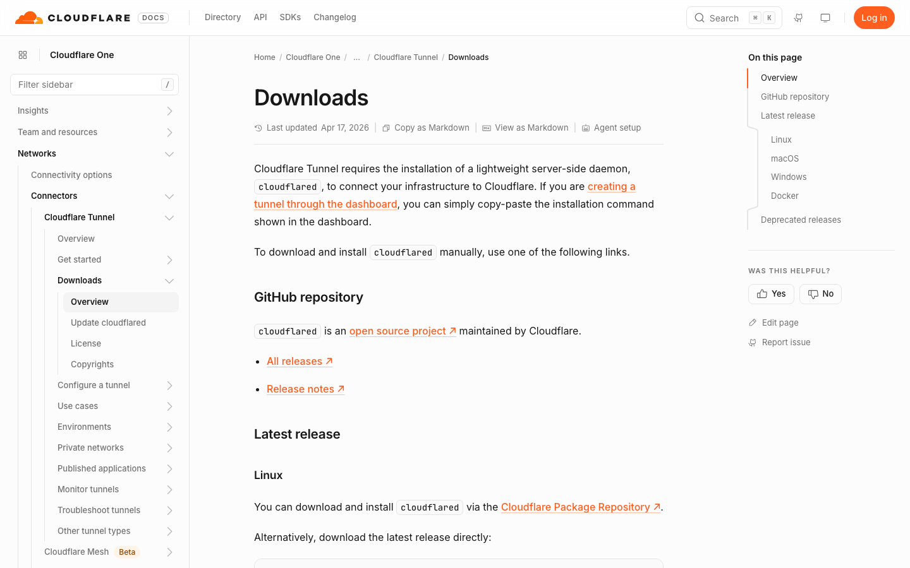

เปิด Terminal **หน้าต่างใหม่** (หน้าต่าง START ต้องเปิดค้าง) แล้ววาง:

```bash
cloudflared tunnel --url http://127.0.0.1:8000
```

ใช้ `127.0.0.1` ห้ามพิมพ์ `localhost` — cloudflared จะไป IPv6 แล้วเครื่องคุณฟัง IPv4

รอจนขึ้นบรรทัดประมาณ:

```text
https://something.trycloudflare.com
```

คัดลอก URL นั้นทั้งก้อน ต่อท้าย `/webhook`  
ได้เป็น `https://something.trycloudflare.com/webhook`

Quick Tunnel สำหรับทดสอบ ชื่อสุ่มเปลี่ยนทุกครั้งที่เปิดใหม่  
คอมพิวเตอร์หลับหรือปิด = บอทตาย

พิมพ์ **เสร็จแล้ว** เมื่อมี URL ที่ขึ้นต้นด้วย `https://` และลงท้าย `/webhook`

---

## สถานี 12 · วาง webhook แล้วกด Verify

เปิด: https://developers.line.biz/console/ → Provider → ชาแนล Messaging API → แท็บ **Messaging API**

1. ช่อง **Webhook URL** กด Edit
2. วาง URL จากสถานี 11
3. Update
4. กด **Verify** — ต้องขึ้น Success
5. เปิดสวิตช์ **Use webhook**

ถ้า Verify ไม่ผ่าน: START ยังเปิดอยู่หรือไม่ · อุโมงค์ชี้ `127.0.0.1:8000` หรือไม่ · URL มี `/webhook` หรือไม่

พิมพ์ **เสร็จแล้ว** เมื่อ Verify ขึ้น Success และ Use webhook เป็นเปิด

---

## สถานี 13 · ทดสอบสองคำถาม

ในแท็บ Messaging API มี **QR code** ของ OA

1. สแกนด้วยมือถือที่ล็อกอิน LINE ของคุณ
2. เพิ่มเพื่อน
3. ถามเรื่องที่ **มีในไฟล์** — ต้องได้คำตอบและชื่อไฟล์ ไม่มีดอกจัน `**`
4. ถามเรื่องมั่ว เช่น สีเสื้อนายกรัฐมนตรี — ต้องถูกปฏิเสธ ไม่เดา
5. ถ้าเงียบ: ดูหน้าต่าง START อย่าเดา

ถ้าข้อ 4 ไม่ปฏิเสธ **ยังห้ามเปิดให้ลูกค้า**

พิมพ์ **เสร็จแล้ว** เมื่อทั้งสองข้อเป็นไปตามนั้น

---

## สถานี 14 · เลือกที่รัน — เครื่องบ้าน หรือคลาวด์

บอทตอบได้แล้วบนเครื่องนี้ ตอนนี้เลือกว่างานจริงจะรันที่ไหน คอมปิด = บอทตาย ทุกทาง

เปิดภาพหน้าสมัครใน `docs/shots/` คู่กับ URL ด้านล่าง — นี่คือหน้าที่คุณต้องสมัครเอง จ่ายเอง (หรืออยู่ฟรีเทียร์) เอเจนต์สมัครแทนไม่ได้

### ทาง A — คอมพิวเตอร์ที่เปิดค้าง (ค่าโฮสต์เพิ่มเป็นศูนย์)

แม็ค / แม็คมินิ / มินิพีซี เปิดทั้งคืน + Cloudflare Tunnel ชุดเดียวกับที่เพิ่งทำ

1. ระบบตั้งค่า → แบตเตอรี่ / พลังงาน → กันเครื่องหลับตอนจอปิด (แม็ค: Prevent automatic sleeping when the display is off)
2. ห้ามปิดฝาแล็ปท็อปถ้าไม่ได้ต่อจอและตั้งให้ฝาปิดแล้วยังไม่หลับ
3. งานจริงทั้งวัน: Named Tunnel ชี้โดเมนคุณ ไม่ใช่ trycloudflare สุ่มชื่อ

ข้อดี: ไฟล์ `knowledge/` อยู่เครื่องคุณ, Ollama ในบ้านได้, ไม่มีใบแจ้งคลาวด์  
ข้อเสีย: ไฟดับ ฝาปิด เครื่องหลับ = ลูกค้าทักแล้วเงียบ

### ทาง B — Railway (เหมาะกับเว็บฮุค 24/7 มากกว่าฟรีเทียร์อื่น)

เปิด: https://railway.com/ → ปุ่ม **Deploy**

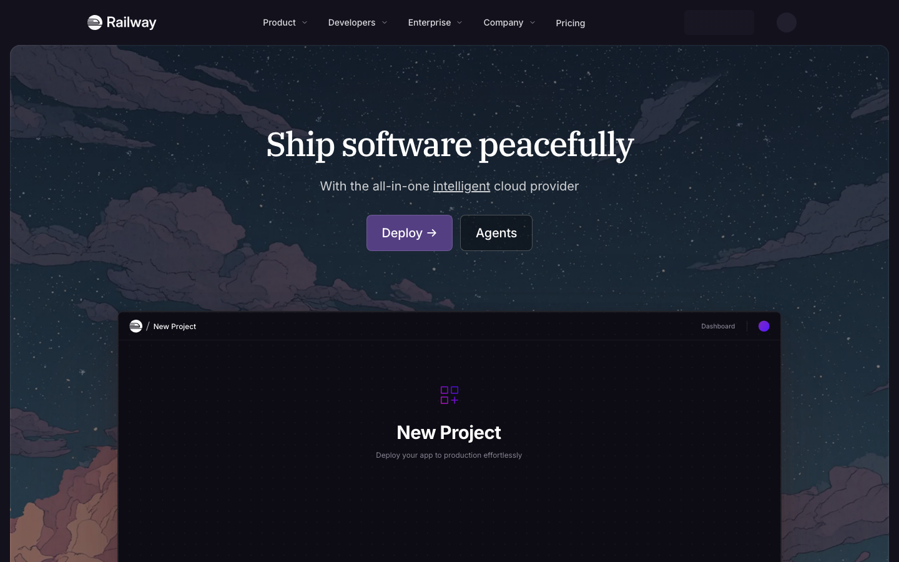

1. Sign up ด้วย GitHub
2. New Project → Deploy from GitHub repo ชุดนี้
3. ใส่ตัวแปรจาก `.env` ในหน้า Variables — อย่าวางคีย์ในแชต
4. ต้องมี volume ถ้าจะเก็บ SQLite ข้ามเดพลอย
5. ตั้ง `HOST=0.0.0.0` ให้รับเว็บฮุคจาก LINE
6. วาง HTTPS URL ของ Railway เป็น Webhook URL แทนอุโมงค์

ทดลองมีเครดิต แล้วคิดตามใช้ ไม่ใช่ฟรีตลอด ดีกว่า Render ฟรีตรงที่คอนเทนเนอร์ไม่ถูกปิดเพราะนิ่งสิบห้านาที

บนคลาวด์ **อย่าพึ่ง Ollama ในเครื่อง** — ใช้ Groq / Gemini สำหรับคำตอบ Embeddings `bge-m3` ต้องมีที่รัน (image ที่มี Ollama หรือส่ง embed ไปบริการอื่น) การโยนไฟล์กลายเป็น git push หรืออัปโหลด ไม่ใช่ลากลงโฟลเดอร์

### ทาง C — Render (ฟรีเทียร์หลับ)

เปิด: https://render.com/ → **Start for free**

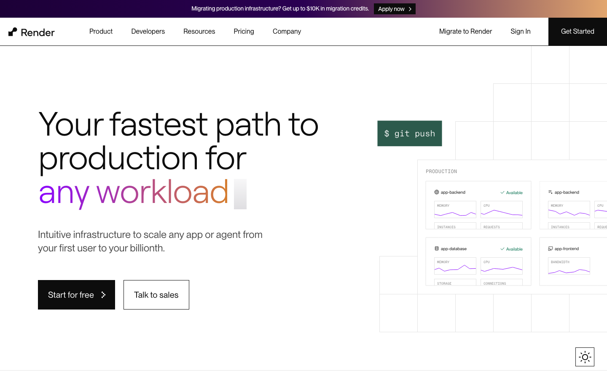

Web Service ฟรี **ปิดหลังนิ่ง ~15 นาที** สตาร์ทใหม่ 30–60 วินาที LINE รอ webhook ไม่ถึงขนาดนั้น ข้อความแรกหลังหลับจะพลาดหรือหมดเวลา

ถ้าจะใช้ Render จริง จ่ายแผนที่เปิดตลอด (~USD 7/เดือน ณ เวลาเขียน) แล้วติด persistent disk ให้ SQLite

### อย่าใช้ Vercel เป็นที่รันบอทนี้

เปิด: https://vercel.com/signup เพื่อรู้ว่าหน้าตาเป็นอย่างไร แล้ว **อย่าเดพลอย FastAPI ชุดนี้ขึ้น Hobby**

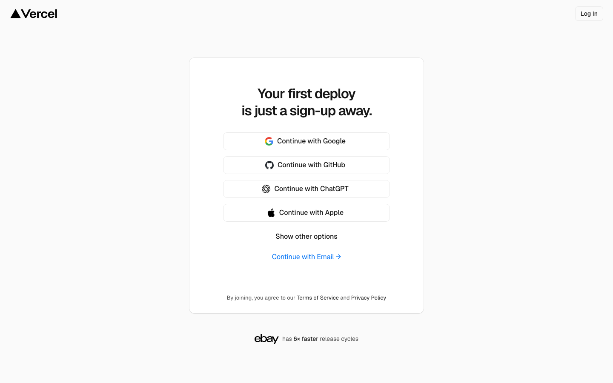

Vercel ออกแบบมาสำหรับเว็บเซิร์ฟเวอร์เลสและหน้าสแตติก ไม่มีโปรเซส FastAPI ค้าง, ไม่มีตัวเฝ้าโฟลเดอร์, SQLite บนดิสก์ชั่วคราวหายทุกเดพลอย, webhook LINE ยาวเกินเพดาน, Ollama ในเครื่องไม่มี

หน้า GitHub Pages ของชุดสอน (`nonarkara.github.io/diy-rag-chatbot`) เป็นสไลด์ ใช้ Vercel/Pages ได้ — **ตัวบอทใช้ไม่ได้**

### สรุปสั้น

| ที่รัน | เงิน | บอท 24/7 | โฟลเดอร์ knowledge | Ollama ในบ้าน |
|---|---|---|---|---|
| แล็ปท็อป/แม็คมินิ + อุโมงค์ | ค่าไฟ | ได้ถ้ายังไม่หลับ | ลากไฟล์ได้ | ได้ |
| Railway | เครดิตแล้วจ่ายตามใช้ | ใกล้เคียง | git / volume | ไม่ |
| Render ฟรี | ศูนย์ | ไม่ — หลับ 15 นาที | ไม่มีดิสก์ถาวร | ไม่ |
| Render จ่าย | ~USD 7/เดือน | ได้ | disk เพิ่ม | ไม่ |
| Vercel Hobby | ฟรี | ไม่ใช่ที่รันบอทนี้ | ไม่ | ไม่ |

พิมพ์ **เสร็จแล้ว** เมื่อเลือกทางแล้ว (A, B, หรือ C จ่าย) และรู้ว่าคอมปิดบอทตาย

---

## สถานี 15 · ต่อ Telegram (ไม่บังคับ — หลังไลน์ตอบได้)

ไลน์คือปากหลักในไทย Telegram เป็นปากที่สอง โปรโตคอลคล้ายกัน: HTTPS webhook

เปิด: https://core.telegram.org/bots

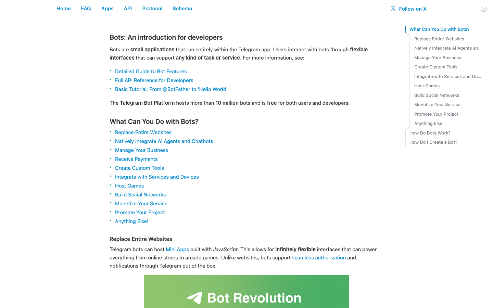

1. บนมือถือเปิด Telegram ค้น **@BotFather** (บัญชีทางการ มีเครื่องหมายถูก)
2. ส่ง `/newbot`
3. ตั้งชื่อที่คนเห็น แล้วตั้ง username ลงท้าย `bot`
4. BotFather ส่งโทเคนมาครั้งหนึ่ง หน้าตาประมาณ `123456789:AAH...`
5. วางใน `.env` ที่ `TELEGRAM_BOT_TOKEN=` เอง อย่าวางในแชต อย่าแคปหน้าจอที่มีโทเคน
6. อุโมงค์หรือโฮสต์คลาวด์ต้องเป็น `https://` สาธารณะ — Telegram ไม่ยิงเข้า `127.0.0.1`
7. โปรแกรมเรียก `setWebhook` ไปที่ `https://ที่อยู่คุณ/webhook/telegram` พร้อม `secret_token` ที่เก็บใน `TELEGRAM_WEBHOOK_SECRET`
8. ทุกคำขอตรวจหัวข้อ `X-Telegram-Bot-Api-Secret-Token` ถ้าไม่ตรงตอบ 403
9. ตอบด้วย Bot API `sendMessage` ไม่ใช่ LINE Push

ทดสอบ: ทักบอทใน Telegram ด้วยคำถามที่มีในไฟล์ แล้วคำถามมั่ว — ต้องปฏิเสธเหมือนไลน์

พิมพ์ **เสร็จแล้ว** เมื่อ Telegram ตอบจากโฟลเดอร์เดียวกัน หรือเมื่อบอกว่าข้ามสถานีนี้

---

## สถานี 16 · ต่อ Discord (ไม่บังคับ — หลังไลน์ตอบได้)

Discord ไม่ใช่แชตวีบุกแบบไลน์ทั้งก้อน ทางที่ชุดนี้รองรับคือ **slash command** ผ่าน Interactions Endpoint ไม่ใช่ Gateway websocket ทั้งวัน (Gateway ไม่เข้ากับ Vercel และหลับบน Render ฟรี)

เปิด: https://discord.com/developers/applications

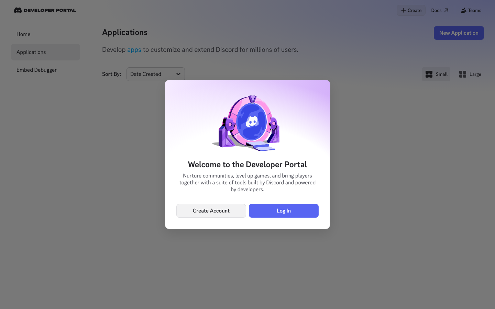

1. **Log In** หรือ **Create Account**
2. ปุ่ม **New Application** ตั้งชื่อ เช่น 「บอทความรู้หน่วยงาน」
3. หน้า General Information คัดลอก **Application ID** และ **Public Key** ไป `.env`: `DISCORD_APP_ID=` `DISCORD_PUBLIC_KEY=`
4. เมนูซ้าย **Bot** → Reset Token → วาง `DISCORD_BOT_TOKEN=` ใน `.env` เอง
5. ไม่ต้องเปิด Message Content Intent ถ้าใช้เฉพาะคำสั่ง `/ask`
6. สร้าง slash command `/ask` พร้อมตัวเลือกข้อความ `q`
7. ช่อง **Interactions Endpoint URL** วาง `https://ที่อยู่คุณ/webhook/discord`
8. Discord ส่ง PING (type 1) ตอนเซฟ URL — โปรแกรมต้องตรวจลายเซ็น Ed25519 จาก `X-Signature-Ed25519` + `X-Signature-Timestamp` บน **raw body** แล้วตอบ `{"type":1}`
9. คำสั่งจริงต้องตอบภายใน 3 วินาที — RAG ช้ากว่านั้น ให้ตอบ type 5 (defer) แล้วส่งคำตอบทีหลังด้วย webhook ของ interaction
10. เชิญบอทเข้าเซิร์ฟเวอร์ด้วยลิงก์ OAuth2 (scope `applications.commands` + `bot`)

อย่าใช้ Discord เป็นที่วางคีย์ อย่าแคปโทเคน

พิมพ์ **เสร็จแล้ว** เมื่อ `/ask` ตอบจากโฟลเดอร์เดียวกัน หรือเมื่อบอกว่าข้ามสถานีนี้

---

## หลังวันนี้

- เพิ่มไฟล์ใน `knowledge/` ได้เลย ระบบอ่านเฉพาะไฟล์ที่เปลี่ยน — จัดตาม [knowledge/HOW-WE-FILE.md](knowledge/HOW-WE-FILE.md)
- งานจริงทั้งวัน: เลือกสถานี 14 ให้จบ (แม็คมินิ / Railway / Render จ่าย) อย่าปล่อย Quick Tunnel
- Telegram และ Discord เป็นปากเพิ่ม หลังไลน์ตอบได้ (สถานี 15–16)
- ถ้าคีย์เคยโผล่ในภาพ ออกโทเคนใหม่แล้วลบของเก่า
- `/privacy` `/forget` `/about` ต้องตอบได้โดยไม่เรียกโมเดล

เมื่อของพัง ดูตารางท้าย `deck/index.html` (สไลด์ 「เมื่อของพัง」) หรือถามเอเจนต์ว่า 「อ่าน START-HERE.md สถานีปัจจุบัน แล้วช่วยดู」

---

## ไฟล์ในชุดนี้

| ไฟล์ | สำหรับใคร |
|---|---|
| `START-HERE.md` | คุณ — จับมือทีละเว็บ รวมที่รัน, Telegram, Discord |
| `AGENTS.md` | เอเจนต์ — ห้ามข้ามขั้น |
| `LINE_RAG_Claude_Code_Master_Prompt.md` | เอเจนต์ — สร้างเครื่อง |
| `knowledge/HOW-WE-FILE.md` | สัญญาจัดเก็บ — คัดลอกจาก Smart City Thailand |
| `docs/shots/` | ภาพหน้าสมัครที่ต้องกดเอง |
| `deck/index.html` | สไลด์ภาษาไทย |
| `LINE_RAG_OA_Guide_TH_Axiom.pptx` / `.pdf` | สำเนานำเสนอ |

แหล่งอ้างอิงปุ่มและลำดับหน้า: LINE Messaging API Getting Started, Build a bot, Receive messages; Cloudflare Quick Tunnels; Ollama gemma4; Groq Console; Google AI Studio; Telegram Bot API; Discord Interactions
