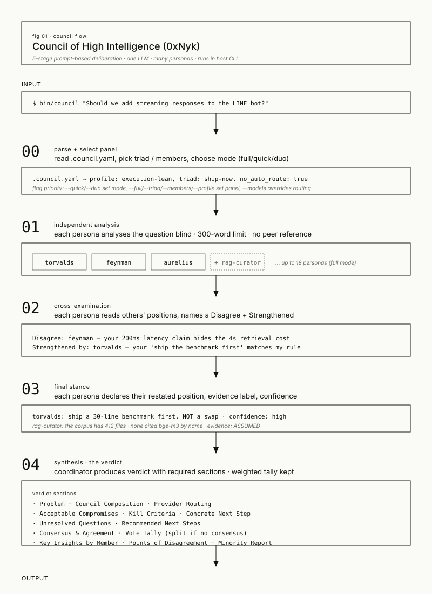
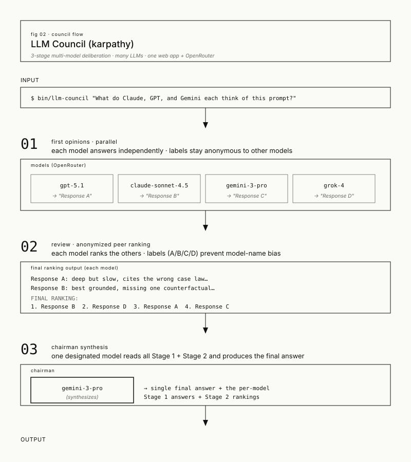
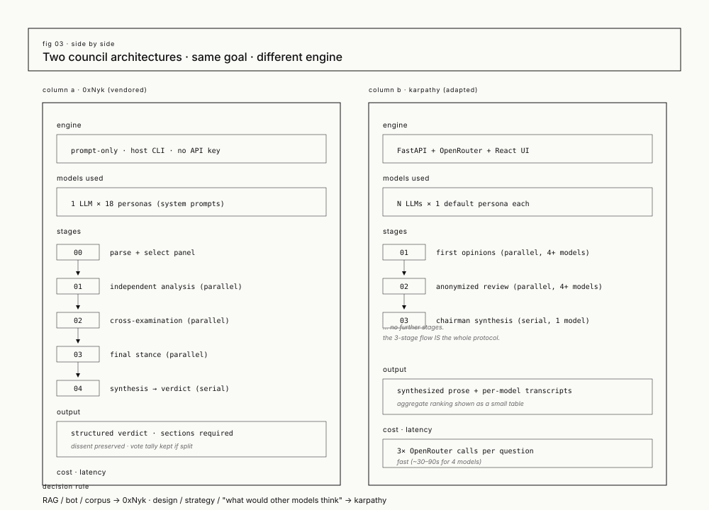

# Council architecture

This repo ships **two council engines**. They share the same goal —
multi-perspective deliberation on hard questions — but they use
different machinery. Pick the right one per question.

| | 0xNyk council (vendored) | karpathy council (adapted) |
|---|---|---|
| Path in this repo | `council/` | `karpathy-council/` |
| Wrapper | `bin/council` | `bin/llm-council` |
| Engine | Prompt-only skill | Web app + OpenRouter API |
| Models | 1 LLM × 18 personas | N LLMs × 1 default persona each |
| Stages | 5 | 3 |
| Latency | 2–12 min (full) | 30–90 s (3 stages) |
| Cost | LLM tokens for the host | 3× OpenRouter tokens |
| Setup | One shell command (`bin/council`) | `git clone` upstream + `uv sync` + OpenRouter key |
| Output | Structured verdict with required sections | Synthesized prose + per-model transcripts |

## When to use which

```
RAG / bot / corpus / prompt question?
  └── yes → bin/council  (0xNyk with rag-curator)

Design / strategy / "what would other models think" question?
  └── yes → bin/llm-council  (karpathy, when its app is running)

Quick yes/no on a code change?
  └── yes → ask the host directly, no council
```

The two wrappers are siblings: they share the same `council-sessions/`
capture folder, the same `.gitignore`, and the same follow-up
checklist. Running both is encouraged.

## The 0xNyk flow (5 stages)

The vendored skill at `council/` defines a fixed 5-round protocol
that runs inside a host CLI (Claude Code, OpenCode, Codex, or
Gemini CLI). One LLM, many personas (system prompts).



- **Stage 00 — Parse + select panel.** Read `.council.yaml`,
  honor explicit CLI flags, pick a triad or full membership.
- **Stage 01 — Independent analysis.** Each persona writes its
  first analysis blind, 300 words, no reference to peers.
- **Stage 02 — Cross-examination.** Each persona reads the others'
  positions and produces a `Disagree:` + `Strengthened by:` pair.
  This is where the dissent gets surfaced.
- **Stage 03 — Final stance.** Each persona restates its position
  and labels its evidence (`EVIDENCED` / `INFERRED` / `ASSUMED`
  / `MISSING` for the RAG curator, or the equivalent for the
  upstream personas).
- **Stage 04 — Synthesis.** The coordinator produces the verdict
  with all required sections. The weighted tally is preserved —
  if the council is split, the verdict returns the split instead
  of manufacturing consensus.

The RAG-specific persona `council-rag-curator` (this repo's local
addition) is auto-included on any question whose keywords match
`retrieval | knowledge | rag | embedding | faithfulness`. It opens
the cited file before commenting on what it says, and labels every
load-bearing claim.

## The karpathy flow (3 stages)

The adapted pattern at `karpathy-council/` is a 3-stage
multi-model deliberation. Each stage runs in parallel across
multiple LLM models via OpenRouter. The two key tricks are
*anonymization* (Stage 2) and *chairman synthesis* (Stage 3).



- **Stage 01 — First opinions.** All council models answer
  independently. Their responses are tagged `Response A`, `B`, `C`,
  `…` so the next stage cannot play favorites.
- **Stage 02 — Review.** Each model receives all of the Stage 1
  responses (still anonymized) and produces a `FINAL RANKING:`
  block listing the responses from best to worst. The orchestrator
  parses these and computes the average rank per model.
- **Stage 03 — Chairman synthesis.** A designated Chairman model
  reads the Stage 1 answers + Stage 2 rankings and produces a
  single, well-reasoned final answer. This is the only serial step.

The full upstream app is a React + FastAPI web app you can run
locally on `:5173` (frontend) and `:8001` (backend). The wrapper
`bin/llm-council` in this repo probes `:8001` and either uses the
running app or falls back to the 0xNyk skill.

## Side by side



The two flows differ on three axes:

| Axis | 0xNyk | karpathy |
|---|---|---|
| Where diversity comes from | Multiple system prompts (personas) on one model | Multiple distinct models, one default persona each |
| How the verdict is built | Each persona restates, then a coordinator synthesizes | Models rank each other, then a chairman model synthesizes |
| How dissent is captured | Each persona's `Disagree:` line + the vote tally | Aggregate ranking table + the chairman's notes on disagreement |

Both flows explicitly preserve dissent. The 0xNyk flow has more
stages and produces a more structured verdict; the karpathy flow
is faster and cheaper but its verdict is closer to a single
synthesized essay.

## How a question travels

For an `0xNyk` question:

```
your shell
  └─ bin/council "the question"
       └─ /council slash command  (host CLI resolves to ~/.claude/skills/council/SKILL.md)
            └─ 5-stage protocol runs inside the host LLM
                 └─ verdict printed to your terminal
                      └─ capture template written to council-sessions/<timestamp>-<slug>.md
```

For a `karpathy` question:

```
your shell
  └─ bin/llm-council "the question"
       ├─ probe http://localhost:8001/
       │    └─ 200 OK → POST to /api/query
       │                  └─ FastAPI runs the 3-stage orchestration
       │                       └─ OpenRouter calls 4+ models in parallel
       │                            └─ JSON response back to your terminal
       │                                 └─ capture written to council-sessions/<timestamp>-<slug>-karpathy.md
       └─ not reachable → fall back to bin/council (the 0xNyk path)
```

The fallback is the safety net. As long as one of the two engines
is reachable, `bin/llm-council` returns an answer.

## Files in this folder

| File | What |
|---|---|
| `flow-0xnyk-council.svg` | The 0xNyk 5-stage flow, vertical, 800×1100 |
| `flow-karpathy-council.svg` | The karpathy 3-stage flow, vertical, 800×900 |
| `flow-comparison.svg` | Both side by side, 1000×720 |
| `council-architecture.md` | This document |

The SVGs use the project's hairline / mono editorial aesthetic.
They render in any modern browser and in GitHub markdown.
