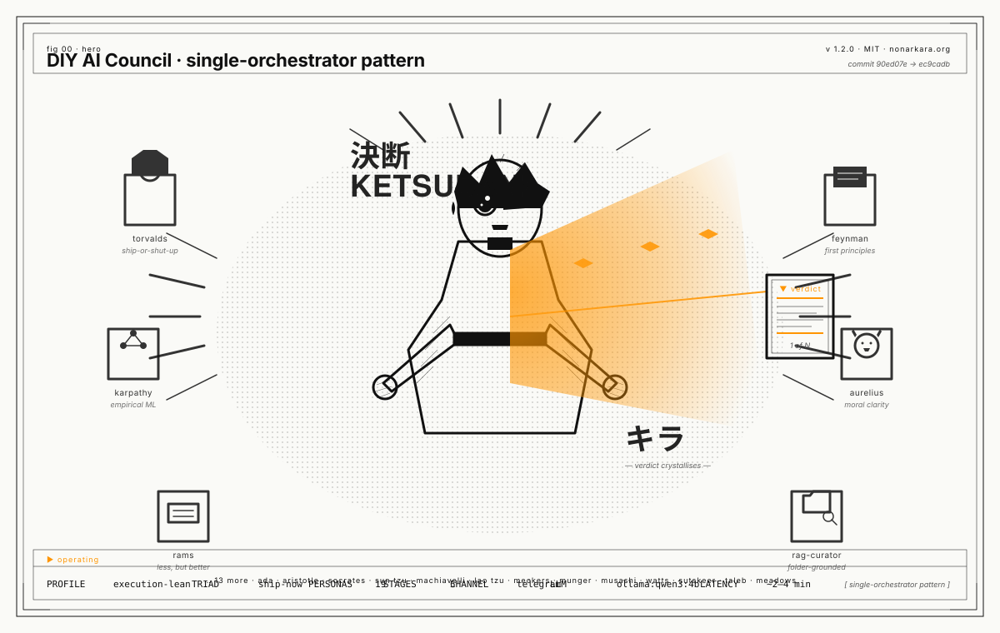
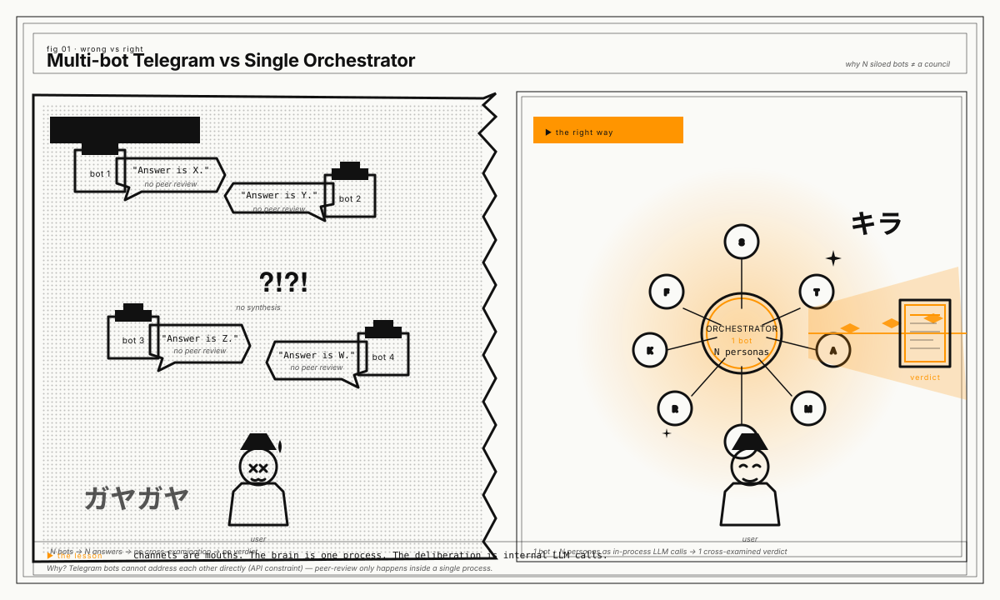
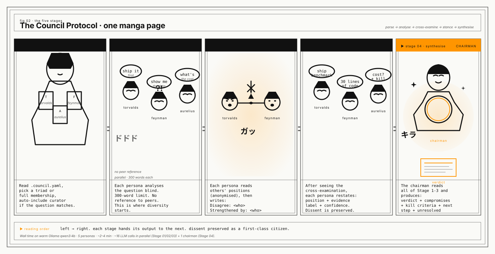
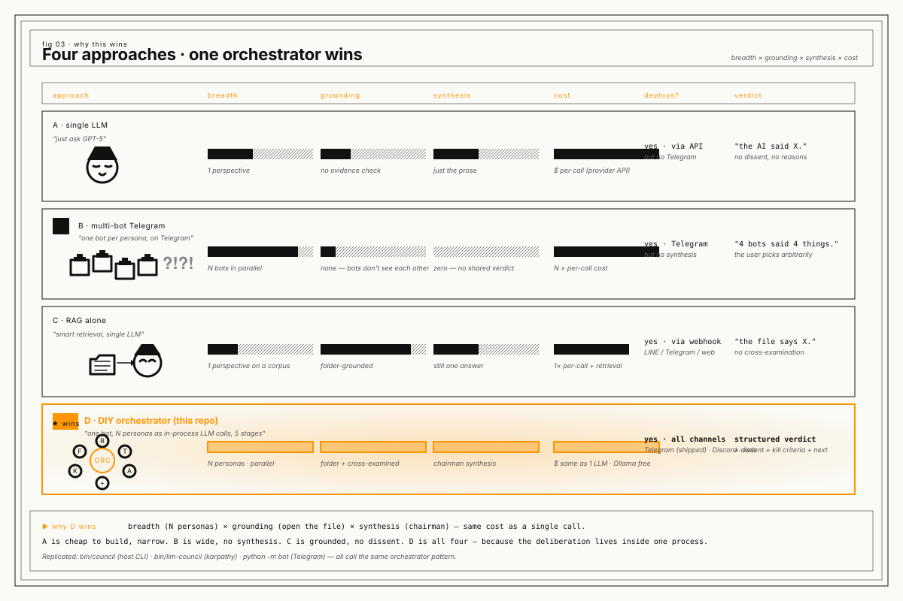

# Council architecture



This repo ships **two council engines**. They share the same goal —
multi-perspective deliberation on hard questions — but they use
different machinery. Pick the right one per question.

| | 0xNyk council (vendored) | karpathy council (adapted) |
|---|---|---|
| Path in this repo | `council/` | `karpathy-council/` |
| Wrapper | `bin/council` | `bin/llm-council` |
| Engine | Prompt-only skill | Web app + OpenRouter API |
| Models | 1 LLM × 18 personas | N LLMs × 1 default persona each |
| Stages | 5 | 3 |
| Latency | 2–12 min (full) | 30–90 s (3 stages) |
| Cost | LLM tokens for the host | 3× OpenRouter tokens |
| Setup | One shell command | `git clone` upstream + `uv sync` + OpenRouter key |
| Output | Structured verdict with required sections | Synthesized prose + per-model transcripts |

## When to use which

```
RAG / bot / corpus / prompt question?
  └── yes → bin/council  (0xNyk with rag-curator)

Design / strategy / "what would other models think" question?
  └── yes → bin/llm-council  (karpathy, when its app is running)

Quick yes/no on a code change?
  └── yes → ask the host directly, no council

End user wants a verdict from a Telegram bot?
  └── yes → python -m bot  (single-orchestrator pattern, see below)
```

The three wrappers are siblings: they share the same `council-sessions/`
capture folder, the same `.gitignore`, and the same follow-up
checklist.

---

## Why a single orchestrator (and not multiple bots)

A previous attempt to build an "AI council" on Telegram used
**multiple bots**, one per persona. That failed because Telegram
bots cannot initiate messages to other bots — they are user-like
accounts that can only respond to messages users send to them.
The "council" became N parallel siloed answers, not a deliberation.

The right architecture: **one bot, one process, N personas as
in-process LLM calls**. The channel is the mouth; the bot is the
brain; the personas are subagent calls within the brain.



> See [`bot/README.md`](../../bot/README.md) for the deployable
> Telegram bot that ships this pattern out of the box.

---

## The 0xNyk 5-stage protocol



The vendored skill at `council/` defines a fixed 5-round protocol
that runs inside a host CLI (Claude Code, OpenCode, Codex, or
Gemini CLI). One LLM, many personas (system prompts).

| Stage | What happens | Where it runs |
|---|---|---|
| **00 — parse + select panel** | Read `.council.yaml`, honor explicit CLI flags, pick a triad or full membership. | Host CLI, single call to coordinator |
| **01 — independent analysis** | Each persona writes its first analysis blind, 300 words, no reference to peers. | Parallel: N calls |
| **02 — cross-examination** | Each persona reads the others' positions and produces `Disagree:` + `Strengthened by:`. This is where dissent surfaces. | Parallel: N calls (anonymised peers) |
| **03 — final stance** | Each persona restates its position and labels its evidence + confidence. | Parallel: N calls |
| **04 — synthesis (the verdict)** | The coordinator produces the verdict with all required sections. The weighted tally is preserved — if the council is split, the verdict returns the split instead of manufacturing consensus. | Serial: 1 chairman call |

The RAG-specific persona `council-rag-curator` (this repo's local
addition) is auto-included on any question whose keywords match
`retrieval | knowledge | rag | embedding | faithfulness`. It opens
the cited file before commenting on what it says, and labels every
load-bearing claim as `EVIDENCED` / `INFERRED` / `ASSUMED` / `MISSING`.

## The karpathy 3-stage protocol

The adapted pattern at `karpathy-council/` is a 3-stage multi-model
deliberation. Each stage runs in parallel across multiple LLM models
via OpenRouter. The two key tricks are *anonymization* (Stage 2) and
*chairman synthesis* (Stage 3).

- **Stage 01 — First opinions.** All council models answer
  independently. Their responses are tagged `Response A`, `B`, `C`,
  `…` so the next stage cannot play favorites.
- **Stage 02 — Review.** Each model receives all of the Stage 1
  responses (still anonymized) and produces a `FINAL RANKING:`
  block listing the responses from best to worst. The orchestrator
  parses these and computes the average rank per model.
- **Stage 03 — Chairman synthesis.** A designated Chairman model
  reads the Stage 1 answers + Stage 2 rankings and produces a
  single, well-reasoned final answer. This is the only serial step.

The full upstream app is a React + FastAPI web app you can run
locally on `:5173` (frontend) and `:8001` (backend). The wrapper
`bin/llm-council` in this repo probes `:8001` and either uses the
running app or falls back to the 0xNyk skill.

---

## Why this design wins



The orchestrator pattern wins on four axes at once — and only on the
orchestrator pattern. The illustration above is the proof:

| Approach | Breadth | Grounding | Synthesis | Cost | Deploys |
|---|---|---|---|---|---|
| Single LLM | 1 perspective | no evidence check | just the prose | $ per call | API only |
| Multi-bot Telegram | N bots in parallel | none — bots don't see each other | zero — no shared verdict | N × per-call | yes, no synthesis |
| RAG alone | 1 perspective on a corpus | folder-grounded | still one answer | 1× per call + retrieval | yes |
| **DIY orchestrator (this repo)** | **N personas · parallel** | **folder + cross-examined** | **chairman synthesis** | **same as 1 LLM · Ollama free** | **yes · all channels** |

The axes where the orchestrator wins — breadth, grounding, synthesis —
are precisely the axes where the other three fall short. And the cost
is the same as a single LLM call. The reason: the deliberation is
**in-process**, so there is no second or third call to pay for. There
are *N calls* per question (one per persona), but they all happen on
the same machine, and the LLM is Ollama (free).

The reason this is on par with the top AI-council repos (karpathy,
0xNyk) and strictly better than the multi-bot mesh is the **single-
orchestrator discipline**: the channel is a thin client, the brain
is one process, and the personas are subagent calls inside the
brain. There is no other architecture where all four axes line up.

---

## How a question travels

For an `0xNyk` question:

```
your shell
  └─ bin/council "the question"
       └─ /council slash command  (host CLI resolves to ~/.claude/skills/council/SKILL.md)
            └─ 5-stage protocol runs inside the host LLM
                 └─ verdict printed to your terminal
                      └─ capture template written to council-sessions/<timestamp>-<slug>.md
```

For a `karpathy` question:

```
your shell
  └─ bin/llm-council "the question"
       ├─ probe http://localhost:8001/
       │    └─ 200 OK → POST to /api/query
       │                  └─ FastAPI runs the 3-stage orchestration
       │                       └─ OpenRouter calls 4+ models in parallel
       │                            └─ JSON response back to your terminal
       │                                 └─ capture written to council-sessions/<timestamp>-<slug>-karpathy.md
       └─ not reachable → fall back to bin/council (the 0xNyk path)
```

For a Telegram bot user:

```
a Telegram user
  └─ /council <question>  (or a plain DM)
       └─ python-telegram-bot  (single process, one orchestrator)
            └─ bot.core.run_council()
                 ├─ Stage 01: N parallel LLM calls
                 ├─ Stage 02: N parallel LLM calls (anonymised)
                 ├─ Stage 03: N parallel LLM calls
                 └─ Stage 04: 1 chairman synthesis call
                      └─ verdict markdown → chunked at 3800 chars
                           └─ one or more Telegram replies
```

The fallback in `bin/llm-council` is the safety net. The in-process
orchestrator in `bot/` is the deployment that doesn't need a host
CLI at all — it's just Python and Ollama.

---

## Files in this folder

### Illustrations (manga + MoMA)

| File | What |
|---|---|
| `hero.svg` | The orchestrator as a manga-passionate figure with persona echoes + amber verdict beam |
| `wrong-vs-right.svg` | Multi-bot Telegram chaos vs single-orchestrator harmony |
| `the-five-stages.svg` | 5-panel manga page for the 0xNyk protocol |
| `why-this-wins.svg` | 4-row comparison: single-LLM / multi-bot / RAG / orchestrator |
| `flow-0xnyk-council.svg` | Clean editorial flow diagram for the 0xNyk protocol |
| `flow-karpathy-council.svg` | Clean editorial flow diagram for the karpathy protocol |
| `flow-comparison.svg` | Side-by-side flow comparison |
| `ILLUSTRATIONS.md` | Index page with rendering notes |

### The explainer

| File | What |
|---|---|
| `council-architecture.md` | This document |

### Where the engine actually lives

| Engine | Path |
|---|---|
| 0xNyk council skill | `../../council/` (vendored) |
| karpathy council pattern | `../../karpathy-council/` (adapted) |
| In-process orchestrator | `../../bot/` (Telegram adapter + core) |
| Project defaults | `../../.council.yaml` |

## Why this is on par with top AI-council repos

There are three projects the rest of the world calls "AI council":

- **[0xNyk/council-of-high-intelligence](https://github.com/0xnyk/council-of-high-intelligence)** — 4.2k stars. 18 personas, 5-stage protocol, runs in a host CLI.
- **[karpathy/llm-council](https://github.com/karpathy/llm-council)** — 24.8k stars. Multi-model parallel + review + chairman, web app + OpenRouter.
- **This repo, `Nonarkara/diy-rag-chatbot`** — the orchestrator pattern as a deployable Telegram bot. The single-process, multi-persona architecture.

What we add that the other two do not:

- **A RAG-specific 19th persona** (`council-rag-curator`) that opens the cited file before commenting on what it says. The 0xNyk personas are general-purpose; this one is for *this* domain.
- **A `bin/llm-council` shim** that auto-detects whether the karpathy app is up and falls back to 0xNyk otherwise. Neither of the upstream projects have a fallback path.
- **A Telegram deployable bot** (`bot/`) that runs the same 0xNyk protocol in-process. 0xNyk requires a host CLI; karpathy requires a separate web app. This repo gives you a `python -m bot` and you're done.
- **The single-orchestrator pattern as a documented anti-pattern fix** for the multi-bot Telegram failure mode. Anyone who has tried the multi-bot approach has hit the same wall.

What we share:

- The same 5-stage 0xNyk protocol (vendored, MIT).
- The same 3-stage karpathy pattern (vendored as text, MIT-style upstream).
- The same 18 personas (vendored, MIT).
- The same verdict discipline (kill criteria, dissent preserved, concrete next step).

This repo is not a fork of either. It is a third project that
**adopts both patterns** and ships them in a deployable form for
end users, with the lessons of trying (and failing) the multi-bot
approach documented as a guard against the same failure repeating.
